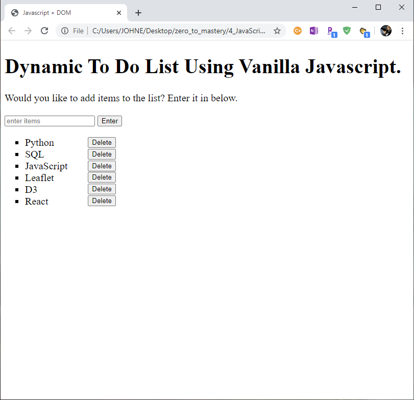

# Dynamic To Do List Using JavaScript

## Purpose & Scope

* For this project, I wanted to further develop my JavaScript skills, so that was where my main focus was. So I created a dynamic to do list by creating event driven functions that allow you to add and delete items from the to do list.

## System Prerequisites
- Visual Studio Code

## Getting Started

* You can download the repository and run on it on your browser or click on the index.html file.

## Output

### Personal Note
* Thank you for viewing and your time!

## Author

* **Johneson Giang** - *Invidual Project* - [Github](https://github.com/jhustles)

## License

This project is licensed under the MIT License - see the [LICENSE.md](LICENSE.md) file for details

## Acknowledgments
* Shout out to the Zero To Mastery Team! 